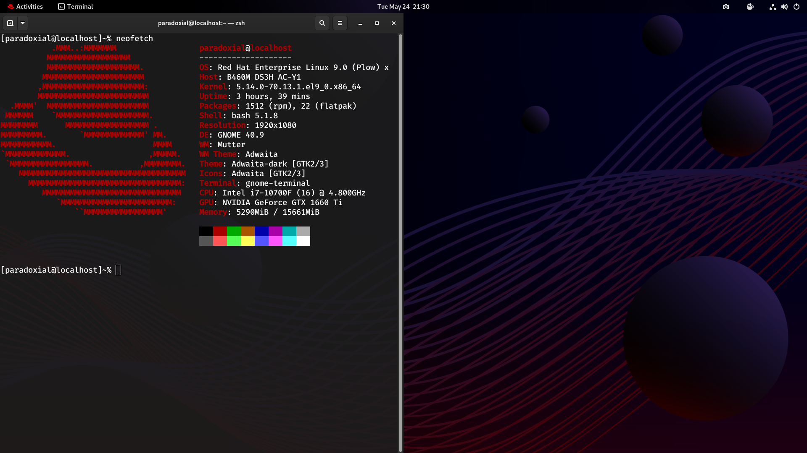

# RHEL-dots

Setup and a very small quantity of dotfiles for my current RHEL installtion, mostly home for my post install script as setting up all of this shit by hand is pain. 

post-install.sh handles installing EPEL, RPM Fusion (Beta and Tainted alongside Free/Nonfree) and some flatpaks as well as my personal dotfiles

coc.sh handles installing (as the name suggests) the CoC plugin for neovim (https://github.com/neoclide/coc.nvim for those wondering) as it requires something else besides installing it with Vim Plug.

That is all.

